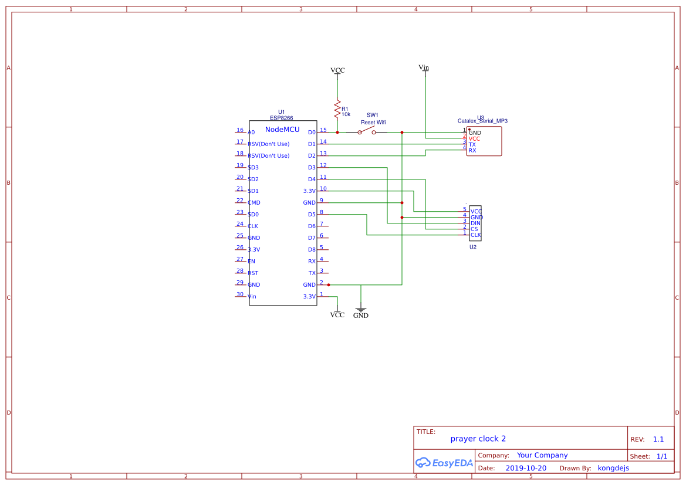

# Muslim Prayer Clock

Time Services :

MuslimThaipost  = "http://www.muslimthaipost.com/prayertimes/index.php?STS"  
NTP Server = "th.pool.ntp.org"  

Hardware Requirements :
1. NodeMCU
2. YX5300 Serial MP3 Player
3. LED Matrix MAX7219

PlatformIO with VSCode using Libraries : pio lib install <LIB>
1. Time
2. ArduinoJson
3. WiFiManager
4. MD_MAX72XX
5. MD_YX5300

Schematic :

By S.kongdej 2019